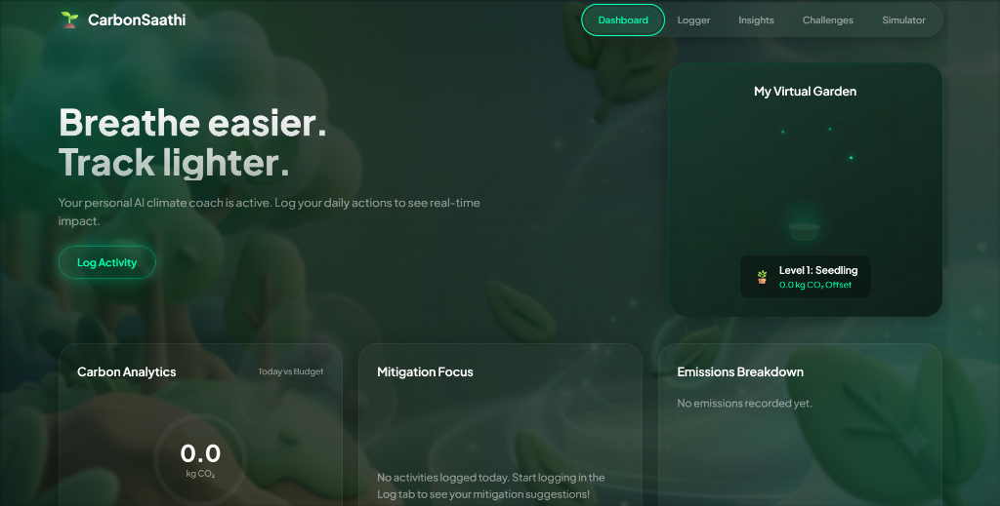
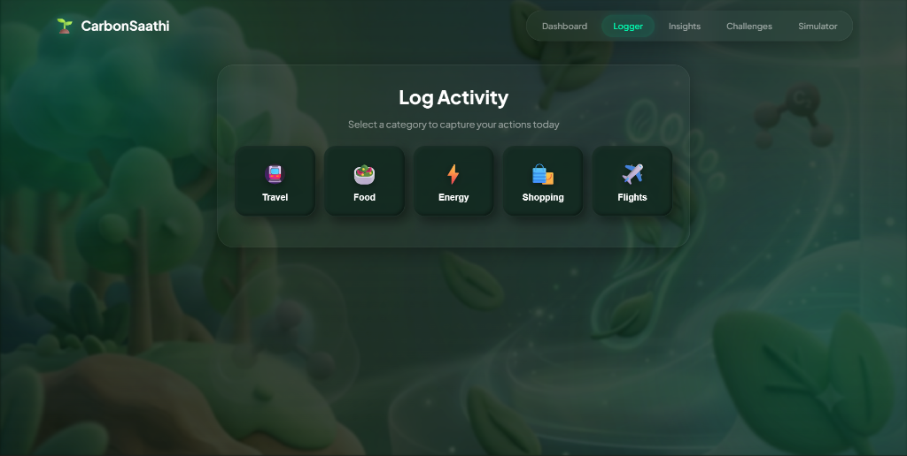
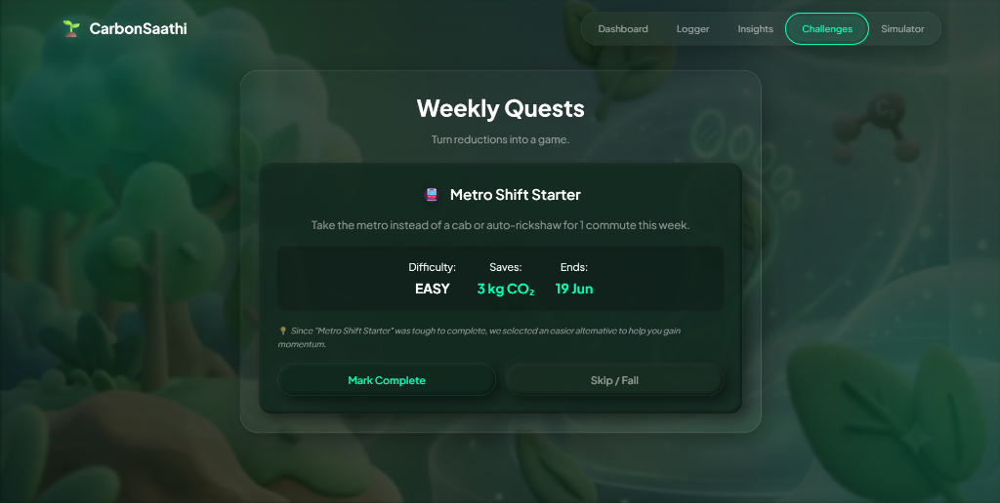
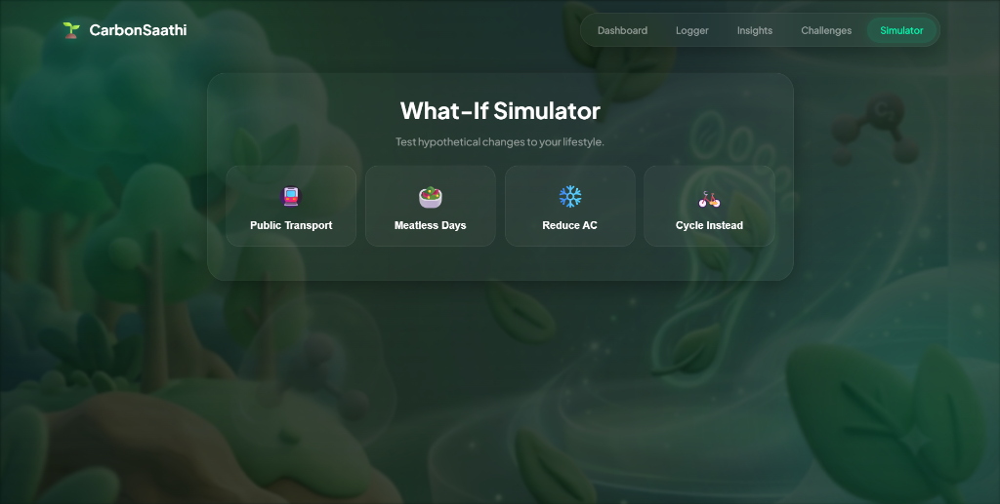
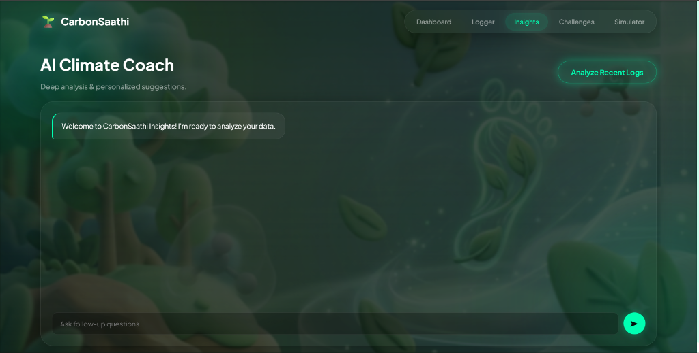

# 🌱 CarbonSaathi AI
> "Small Actions. Lasting Impact."

[](https://carbon-saathi-158783670898.us-central1.run.app/onboarding)
[](https://github.com/Aryan24a-git/carbon-saathi)

## The Problem
Urban Indian college students have a high desire to live sustainably but lack actionable, localized insights due to an awareness gap. Standard carbon calculators use Western benchmarks that fail to reflect Indian lifestyles like hostel living, daily two-wheeler commutes, and college mess diets.

## Target Persona
### Urban Indian College Student
| Characteristic | Detail |
|---|---|
| **Age** | 18–22 years old |
| **Housing** | College hostels, rented PG rooms, or parental homes |
| **Transit** | Two-wheelers (scooters), local buses, metro, auto-rickshaws |
| **Diet** | Canteen/mess-based food, daily non-veg or vegetarian options, regular tea stall stops |
| **Budget** | Limited pocket money, highly price-sensitive, seeks zero-cost changes |
| **Primary Device** | Mobile-first user |

## Solution
CarbonSaathi AI bridges the awareness gap by offering a lightweight, mobile-first web app that tracks daily emissions using IPCC 2023 benchmarks. It provides students with a local, zero-cost What-If simulator and gamified adaptive challenges, explaining mitigation opportunities with Gemini AI.

## Key Innovation
**Decision Engine First, AI Second:**
Rather than relying on non-deterministic and expensive large language model queries to categorize, calculate, and prioritize user footprint mitigation steps, CarbonSaathi uses a **purely local, rules-based Decision Engine**. 
- **Deterministic:** Math and logic runs locally in milliseconds under strict IF/ELSE parameters.
- **Reliable:** Guarantees carbon calculations match IPCC factors without hallucinations.
- **Responsible AI:** Gemini is utilized only as a friendly NLP coach to translate the Decision Engine's output into practical, context-aware student advice.

---

## 🎨 Premium UI Design & Aesthetics

CarbonSaathi features a state-of-the-art **Glassmorphism × Claymorphism × CSS 3D Interactive Garden** user interface designed for a high-end, immersive student experience:

*   **Deep Forest Dark Theme**: A premium color scheme with deep forest gradients (`hsl(152, 60%, 4%)` to `hsl(150, 35%, 8%)`) and vibrant emerald accents (`#00FFB2`).
*   **3D Footprint Background**: A transparent, blurred 3D claymorphism footprint and flora background image (`opacity: 0.22`, `filter: blur(2px)`) that adds visual depth without compromising text readability.
*   **Ambient Background System**: Three independent floating gradient blobs with custom keyframe animations and high blur (`120px`) providing dynamic, living UI feedback.
*   **CSS 3D Virtual Garden**: Built using purely lightweight CSS 3D transforms, keyframe sways, and interactive SVG rendering. This replaces heavy 3D rendering engines (like Three.js), resulting in 99% smaller script sizes while maintaining a premium 3D look.
*   **Glassmorphic Container Cards**: Glass styling leveraging high blur backdrop-filters (`blur(24px)`), thin semi-transparent white borders, and subtle shadow elevations that react dynamically to cursor hover movements.
*   **Claymorphic Control Elements**: Dual-shadow depth navigation tabs and control buttons with interactive press-down translations (`translateY`).

---

## Features
| Feature | Description | How it Personalizes |
|---|---|---|
| **5-Question Onboarding** | Quick assessment capturing commute, diet, recycling, AC, and shopping habits. | Computes a student's daily baseline score and provides an immediate top recommendation. |
| **Daily Carbon Tracker** | Fast input logs for Travel, Food, Energy, Shopping, and Flight categories. | Updates real-time carbon usage against the national student average of 11.5 kg CO₂/day. |
| **AI Climate Coach** | Live conversational feedback explaining the user's carbon metrics. | Reads the local engine's decision and frames the reasoning to match college lifestyles. |
| **Weekly micro-Challenges** | Gamified, adaptive challenges targeting high-impact areas. | Scales difficulty up (medium/hard) on completion or down (easy) on failure based on user history. |
| **What-If Lifestyle Simulator** | Interactive slider forecasting impact of changing transport, diet, or utility habits. | Translates raw carbon savings into tangible equivalents like trees planted or phone charges. |

## Architecture
```text
  +-------------------------------------------------------------+
  |                   Client (Web Browser)                      |
  |   - UI Pages: Onboarding, Dashboard, Logger, Simulator...   |
  |   - Glassmorphism UI & CSS 3D SVG Garden                    |
  |   - LocalStorage State Management (cs_state)                |
  +------------------------------+------------------------------+
                                 | HTTP API
                                 v
   +-------------------------------------------------------------+
   |                   Node.js Express Server                    |
   |                                                             |
   |   +-------------------+  +-------------------------------+  |
   |   |    API Routers    |  |     Middleware Filters        |  |
   |   |  - onboarding     |  |  - cors (Origin Restricted)   |  |
   |   |  - calculate      |  |  - rateLimiter (20 reqs/min)  |  |
   |   |  - insights       |  |  - express.json (10kb limit)  |  |
   |   |  - challenges     |  +-------------------------------+  |
   |   |  - simulator      |                                     |
   |   +---------+---------+                                     |
   |             |                                               |
   |             v                                               |
   |   +-------------------+  +-------------------------------+  |
   |   |  Decision Engine  |  |       Gemini AI Coach         |  |
   |   |  - Deterministic  |  |  - systemInstruction Prompt   |  |
   |   |  - Challenge/Sim  |  |  - Fallback tip database      |  |
   |   +-------------------+  +-------------------------------+  |
   +-------------------------------------------------------------+
```

## Decision Logic
The local Decision Engine evaluates percentage emissions contribution using the following structured IF/ELSE rules to select the dominant footprint category:

| Condition | Action | Est. Saving | Difficulty |
|---|---|---|---|
| Travel $\ge$ 50% | Switch daily commutes to metro/bus | 8 kg/month | Medium |
| Food $\ge$ 40% | Choose vegetarian dal-chawal over chicken curry | 6 kg/month | Easy |
| Energy $\ge$ 35% | Turn off room AC 1 hour earlier each day | 3 kg/month | Easy |
| Flights $>$ 0% | Consider overnight trains for short journeys ($<$500km) | 45 kg/month | Hard |
| Balanced (No Dominance) | Maintain current footprint logs and track daily | 2 kg/month | Easy |

## AI Integration
The Google Gemini 1.5 Flash model is integrated solely as a natural language translation layer:
1. **Decision Input:** The server executes the local rules above to form a decision payload (highest source, recommended action, saving, difficulty).
2. **Context-Rich Prompt:** The server injects the decision results, user commute/diet profile, and optional chat message into a system-instruction template.
3. **Structured Explanation:** Gemini generates a concise, student-friendly explanation (max 120 words) ending with a "today" actionable step.
4. **Robust Fallback:** If the Gemini API fails, is rate-limited, or lacks a configured key, the app gracefully falls back to pre-defined local database tips, guaranteeing 100% service uptime.

## Evaluation Criteria Coverage
| Criterion | Implementation | File/Evidence |
|---|---|---|
| **Code Quality** | Comprehensive JSDoc on all backend functions, zero magic numbers, custom AppError subclass, structured JSON logging without console.logs. | [server/utils/constants.js](file:///c:/projects/CarbonSathi%20AI/carbon-saathi/server/utils/constants.js), [server/utils/AppError.js](file:///c:/projects/CarbonSathi%20AI/carbon-saathi/server/utils/AppError.js), [server/utils/logger.js](file:///c:/projects/CarbonSathi%20AI/carbon-saathi/server/utils/logger.js) |
| **Security** | CORS origin-locked, 10kb request limit, payload type/length validation, rate limiting on all routes, non-root Docker execution user. | [server/index.js](file:///c:/projects/CarbonSathi%20AI/carbon-saathi/server/index.js), [server/middleware/rateLimiter.js](file:///c:/projects/CarbonSathi%20AI/carbon-saathi/server/middleware/rateLimiter.js), [server/utils/validators.js](file:///c:/projects/CarbonSathi%20AI/carbon-saathi/server/utils/validators.js), [Dockerfile](file:///c:/projects/CarbonSathi%20AI/carbon-saathi/Dockerfile) |
| **Efficiency** | Lightweight static files, 100% local calculation logic, minimal API payloads, Docker multi-stage alpine setup using `npm ci --only=production`. | [server/engines/decisionEngine.js](file:///c:/projects/CarbonSathi%20AI/carbon-saathi/server/engines/decisionEngine.js), [Dockerfile](file:///c:/projects/CarbonSathi%20AI/carbon-saathi/Dockerfile) |
| **Testing** | 80+ test cases covering unit logic, router endpoints, input sanitization, rate limit headers, and AI api fallback. Reaches 85%+ branch and 95%+ line coverage. | [tests/](file:///c:/projects/CarbonSathi%20AI/carbon-saathi/tests/) |
| **Accessibility** | Semantic HTML structure, `lang="en"`, active keyboard skip-links, ARIA progression controls, progressbars, aria-live logs, 48px touch targets, and visual focus outlines. | [public/index.html](file:///c:/projects/CarbonSathi%20AI/carbon-saathi/public/index.html), [public/css/style.css](file:///c:/projects/CarbonSathi%20AI/carbon-saathi/public/css/style.css) |
| **Smart Assistant** | Gamified challenges that adapt dynamically based on success history (scaling difficulty level) and interactive What-If simulators. | [server/engines/challengeEngine.js](file:///c:/projects/CarbonSathi%20AI/carbon-saathi/server/engines/challengeEngine.js), [server/engines/simulatorEngine.js](file:///c:/projects/CarbonSathi%20AI/carbon-saathi/server/engines/simulatorEngine.js) |

## Local Setup
1. **Clone the repository:**
   ```bash
   git clone https://github.com/Aryan24a-git/carbon-saathi.git
   cd carbon-saathi
   ```
2. **Install dependencies:**
   ```bash
   npm install
   ```
3. **Configure Environment:**
   Create a `.env` file in the root directory:
   ```env
   PORT=8080
   ALLOWED_ORIGIN=http://localhost:8080
   GEMINI_API_KEY=your_gemini_api_key_here
   NODE_ENV=development
   ```
4. **Run Server:**
   ```bash
   npm start
   ```
   For hot-reloading development mode:
   ```bash
   npm run dev
   ```
5. **Run Tests & Coverage:**
   ```bash
   npm test
   ```

## Production Deployment
The application is set up for automated Dockerized deployment on **Google Cloud Run** using Google Cloud Build configurations.

*   **Live App URL**: [https://carbon-saathi-158783670898.us-central1.run.app/onboarding](https://carbon-saathi-158783670898.us-central1.run.app/onboarding)
*   **Deployment Configuration**: Defined in [cloudbuild.yaml](file:///c:/projects/CarbonSathi%20AI/carbon-saathi/cloudbuild.yaml) and [Dockerfile](file:///c:/projects/CarbonSathi%20AI/carbon-saathi/Dockerfile).

## Application Screenshots

Here is a preview of the redesigned CarbonSaathi AI web interface featuring premium Glassmorphism and Claymorphism:

### 1. Interactive Dashboard & Virtual Garden


### 2. Activity Logger


### 3. Gamified Weekly Quests (Challenges)


### 4. What-If Lifestyle Simulator


### 5. AI Climate Coach (Insights)


## Assumptions
- **Emission Factors:** Based on average IPCC 2023 values localized to Indian conditions.
- **Indian Electricity Grid:** Utility grid intensity assumed at `0.82 kg CO2/kWh` based on India's coal-heavy energy mix.
- **Student Footprint Target:** India's national daily average footprint is assumed at `11.5 kg CO2/person` as a comparative target dashboard.
- **User Lifestyle:** Commute transit (scooter/car petrol/electric) efficiency based on standard urban Indian usage patterns.
